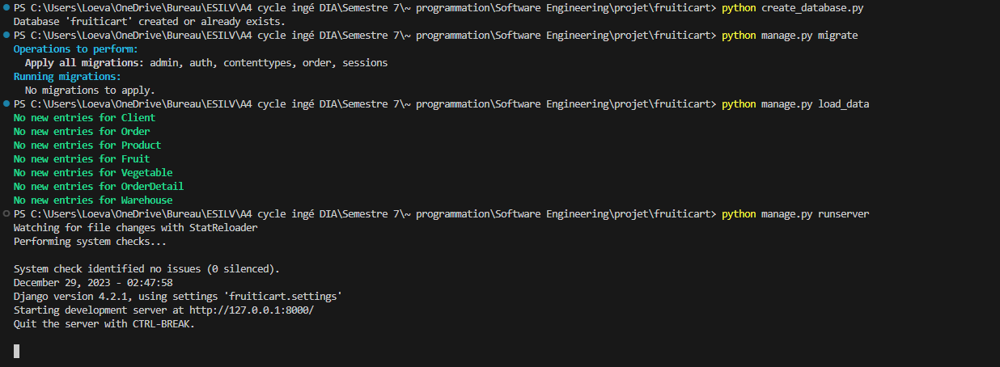

# Software Engineering - project

Here the reposiroty of the project of Software Engineering course.

You will find the following directories/files:
- `captures`: contains the captures of the application
- `fruiticart`: contains the source code of the application
- `catalog.pdf`: contains the catalog of the products for our website
- `demo_video.mp4`: contains the demo video of our application
- `diagram.mdj`: contains the diagram of our database
- `init.sql` and `load.sql`: contain the SQL scripts to initialize the database
- `presentation.pdf`: contains the presentation of our project (done on 18/12/2023)
- `README.md`: this file
- `report.pdf`: contains the report of our project

## Setup

To setup the project, you need to have MySQL installed. You also need basic libraries for python and in particular **django** and **mysql.connector**.

## How to run the application

To run the application, you need to run the following commands, **in the first `fruiticart` directory (the one containing `manage.py`)**:
- `python manage.py makemigrations`
- `python manage.py migrate`
- `python manage.py load_data`
- `python manage.py runserver`

Here an image of the commands to run, with the expected output:

Then, you can access the application at the following address: `http://127.0.0.1:8000/order/home` (in function of the port used by the server).

## How to use the application

To use the application, you need to create an account. Then, you can login and use the application. You can add products to your cart, and then order them. You can also see your orders and your profile.

There's also some accounts already created, the one to test the application is:
- email: *test@test*
- password: *test*

Don't hesitate to see the demo video to see how to use the application.

If you have any questions, you can contact us at the following address: *loevan.le_quernec@edu.devinci.fr*.

## Some specifications

- We created a `data.json` file to load the data in the database. We used the `load_data` command that we created in our app *order* to load the data in the database.
- You can also download the catalog of the products directly on the website, by clicking on the button *Download our catalog!*.
- We didn't use any authentication system provided by Django, we simply ask the database if the user exists or not.

## How to go further?

If we had more time, we would have done the following things (in the next sprint):
- Add a search bar to search products and a filter (by name, by origin, by price, etc.)
- Add a detailed page for each product
- Use the authentication system provided by Django

Also, we would add an entire admin part, where we would be able to (in futures sprint):
- Add products
- Delete products
- Update products
- See the orders
- See the users
- See the messages sent by the users
- Some statistics